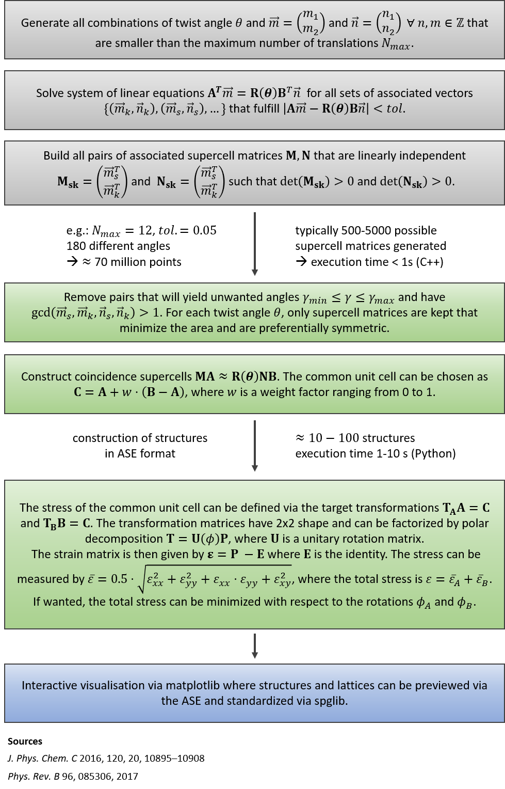

# Algorithm Details

## Overview



## Coincidence Lattices

Coincidence lattices are determined with the algorithm outlined by Schwalbe-Koda ([1]).

[1]: https://doi.org/10.1021/acs.jpcc.6b01496 ". Phys. Chem. C 2016, 120, 20, 10895-10908"

Two 2D lattice bases (lattice vectors are given as column vectors) are given by:

```math
\mathbf{A} = \begin{pmatrix} a_{11} & a_{21} \\ a_{12} & a_{22} \end{pmatrix} ~~~~
\mathbf{B} = \begin{pmatrix} b_{11} & b_{21} \\ b_{12} & b_{22} \end{pmatrix}
```

Such that each point in the 2D plane is given by the coefficients:

```math
P(m_1, m_2) = m_1 \vec{a}_1 + m_2 \vec{a}_2 ~~~~
P(n_1, n_2) = n_1 \vec{b}_1 + n_2 \vec{b}_2
```

Additionally, the two bases can be rotated with respect to each other:

```math
\mathbf{R}(\theta) = \begin{pmatrix} \cos(\theta) & -\sin(\theta) \\ \sin(\theta) & \cos(\theta) \end{pmatrix}
```

Two lattice points of the two bases coincide under the following condition:

```math
\begin{pmatrix} \vec{a}_1 & \vec{a}_2 \end{pmatrix} \begin{pmatrix} m_1 \\ m_2 \end{pmatrix}
= \mathbf{R}(\theta) \begin{pmatrix} \vec{b}_1 & \vec{b}_2 \end{pmatrix}
\begin{pmatrix} n_1 \\ n_2 \end{pmatrix} \\
```
```math
\mathbf{A} \vec{m} = \mathbf{R}(\theta) \mathbf{B} \vec{n}
```

As a tolerance criterion, coincidence is accepted if the distance between the coinciding lattice points is smaller than a threshold:

```math
| \mathbf{A} \vec{m} - \mathbf{R}(\theta) \mathbf{B} \vec{n} | \leq tolerance
```

Solving this system of linear equations yields a set of associated vectors for each angle:

```math
S(\theta) = \{ (\vec{m_1}, \vec{n_1}), (\vec{m_2}, \vec{n_2}), ..., (\vec{m_s}, \vec{n_s}), ..., (\vec{m_k}, \vec{n_k}) \} \\
```

From any pair of these associated vectors that is linearly independent, one can construct supercell matrices from the row vectors:

```math
\mathbf{M} = \begin{pmatrix} m_{s1} & m_{s2} \\ m_{k1} & m_{k2} \end{pmatrix}~~~~
\mathbf{N} = \begin{pmatrix} n_{s1} & n_{s2} \\ n_{k1} & n_{k2} \end{pmatrix}
```

This represents a very large set of possible supercell matrices. For practical purposes, this one is reduced by multiple criteria.

First, all unit cell multiples are removed:

```math
\text{gcd}(m_{s1}, m_{s2}, m_{k1}, m_{k2}, n_{s1}, n_{s2}, n_{k1}, n_{k2}) = 1
```

Second, positive entries are preferred over negative ones:
```math
\text{sum}(m_{s1}, m_{s2}, m_{k1}, m_{k2}, n_{s1}, n_{s2}, n_{k1}, n_{k2})~\forall~\mathbf{M},\mathbf{N}~\text{where det}(\mathbf{M})~\text{is equal} \rightarrow \text{max}
```

Third, symmetric matrices are preferred over unsymmetric ones:
```math
m_{k1} = m_{s2}~\text{and}~n_{s1} = n_{k2}~\forall~\mathbf{M}, \mathbf{N}~\text{where det}(\mathbf{M})~\text{is equal}
```

Lastly, for each twist angle, only the ones that minimize the area are kept:
```math
\forall~\mathbf{M}, \mathbf{N} ~ \in ~ S(\theta)~\text{keep}~\text{min}(\text{det}(\mathbf{M}))
```

Then, the coincidence unit cells for both lattices are constructed by:

```math
\mathbf{MA} \approx \mathbf{N} \mathbf{R}(\theta) \mathbf{B}
```

The new unit cell of the resuling heterostructure can be chosen as a linear combination of the two:

```math
\mathbf{C} = \mathbf{MA} + w \cdot (  \mathbf{N} \mathbf{R}(\theta) \mathbf{B} - \mathbf{MA} )
```

Where the weight factor ranges from 0 to 1.

## Stress definitions and geometric matching

As a measure of stress, one can define the target transformation matrices:

```math
\mathbf{T_A} \mathbf{MA} = \mathbf{C} ~~~~ \mathbf{T_B}  \mathbf{N} \mathbf{R}(\theta) \mathbf{B} = \mathbf{C}
```

These are two-dimensional and can be polarly decomposed:

```math
\mathbf{T} = \mathbf{U}(\phi)\mathbf{P}
```

From which one can define a stress matrix:

```math
\mathbf{\varepsilon} = \mathbf{P} - \mathbb{I}
```

And a stress measure:

```math
\bar{\varepsilon} = \sqrt{\frac{\varepsilon_{xx}^2 + \varepsilon_{yy}^2 +\varepsilon_{xy}^2 + \varepsilon_{xx} \cdot \varepsilon_{yy}}{4}}
```

And a total stress on both unit cells:
```math
\varepsilon_{tot} = \bar{\varepsilon}_A + \bar{\varepsilon}_B
```

This total stress can be minimized with respect to the individual rotation of the unit cells while taking the weight factor from the definition of the target unit cell above into account.
