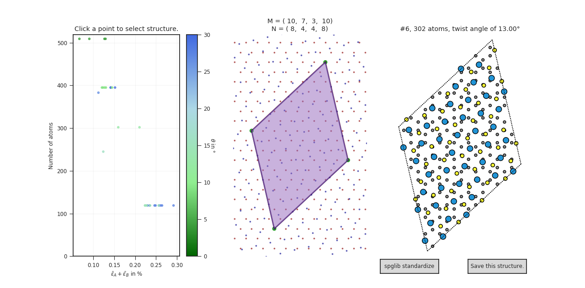

# Building Interfaces

## How to build an interface

The **interface** class from the **interfaces** module is wrapped in the *build_interface* command line tool or can be called from the python interface.

```bash
build_interface bottom.cif top.cif -N 10 --angle_stepsize 1
```

This is equivalent to:

```python
from interfacebuilder.main import interface
intf = interface("graphene.xyz", "WS2_2H_1L.xyz", N_translations=10, angle_stepsize=1.0)
intf.analyze_results()
intf.plot_results()
```

An interactive interface via matplotlib will show up:



Any point on the left hand side can be clicked on to show the overlapping grid points, the entries of the supercell matrices, and a preview of the resulting heterostructure with the twist angle. Clicking on the button on the bottom right will save the structure to an .xyz file, with the following log:

```
INFO    │ Saved structure to C24S14W7_M2-242_N-2-31-2_a71.00.xyz
```

The first part represents the chemical formula, then the coefficients of the matrix **M**, the coefficients of the matrix **N** and the twist angle. Note that these are the transformation matrices of the primitive unit cells in standard form.

The button "spglib standardize" will perform a standardization via the Space Group Library and preview the resulting structure.


## Accessing Data

To access the underlying data, such as the stress tensors, one has to call the interfacebuilder from python. After analysis, all structure information is stored in the form a named tuple called a "stack" in a list that can be accessed from the *interface.solved* attribute. The index of the structure is shown in the interactive plot on the right.

```python
intf.analyze_results()
# Access the first element of the solved stacks:
example = intf.solved[0]
# The stack tuple has the attributes atoms, M, N, angle, stress, stress_A and stress_B
atoms = example.atoms
# It's very easy to filter this data structure, for example for a specific angle:
angle = 30
filtered = [k for k in intf.solved if k.angle == angle]
# The atoms attribute is an ASE atoms object and can easily be written to a file:
atoms.write("name.xyz")
```


